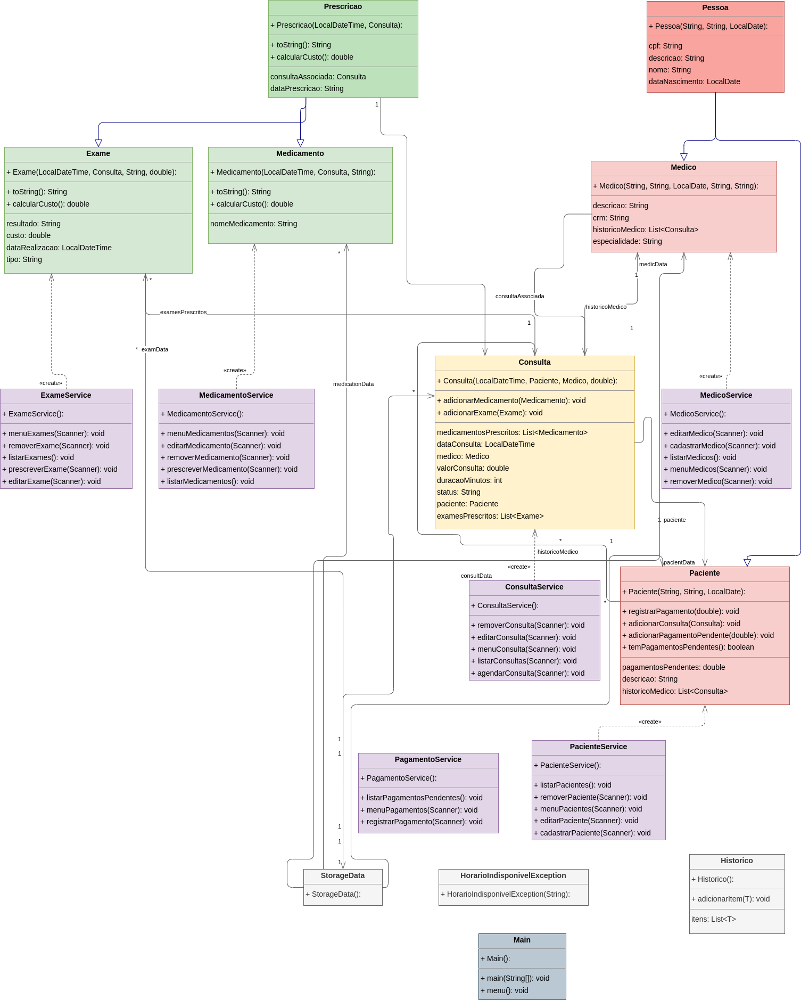

# Universidade de Brasília - UnB Gama

## Desenvolvimento de um Sistema de Gerenciamento de Clínica Médica

**Luara Cristiana da Costa e Silva - 232033830**

Brasília-DF, 14 de fevereiro de 2025

---

## Objetivo

Desenvolver um sistema em Java que aplique os conceitos de orientação a objetos, garantindo modularidade, encapsulamento, herança, polimorfismo e tratamento de exceções personalizadas.

---

## Desenvolvimento

Este relatório apresenta uma análise detalhada do sistema modelado no diagrama de classes fornecido. O sistema é voltado para o gerenciamento de consultas médicas, integrando funcionalidades como cadastro de pacientes e médicos, agendamento de consultas, prescrições de medicamentos e exames, além de controle de pagamentos. Os conceitos fundamentais da Programação Orientada a Objetos (POO) – associações, herança, polimorfismo e tratamento de exceções – foram aplicados para criar uma estrutura modular, reutilizável e escalável.

---

## Estrutura Geral do Sistema

O sistema é composto por:

- **Entidades principais**: `Pessoa`, `Paciente`, `Medico`, `Consulta`, `Prescricao`, `Exame`, `Medicamento`.
- **Serviços**: Classes responsáveis por gerenciar operações relacionadas às entidades (`ConsultaService`, `PacienteService`, etc.).
- **Tratamento de exceções**: Classes customizadas para erros específicos relacionados ao domínio (`HorarioIndisponivelException`, `EspecialidadeInvalidaException`, e `PagamentoPendenteException`).
- **Armazenamento**: Classe `StorageData` para persistência temporária dos dados.
- **Interface principal**: Classe `Main` para interação com o usuário.

---

## Associações

As associações entre as classes representam os relacionamentos entre diferentes elementos do sistema.

### Consulta

A classe `Consulta` é o núcleo do sistema e está associada a várias entidades:

- **Paciente**:
  - Cada consulta está vinculada a um único paciente.
  - Multiplicidade: Uma consulta possui um paciente (1), mas um paciente pode ter várias consultas (1..*).

- **Medico**:
  - Cada consulta é realizada por um único médico.
  - Multiplicidade: Um médico pode atender várias consultas (1..*), mas cada consulta está associada a apenas um médico (1).

- **Medicamento**:
  - Uma consulta pode prescrever vários medicamentos.
  - Multiplicidade: Uma consulta possui uma lista de medicamentos (0..*).

- **Exame**:
  - Uma consulta pode solicitar múltiplos exames.
  - Multiplicidade: Uma consulta possui uma lista de exames prescritos (0..*).

---

## Herança

A herança foi utilizada para evitar redundâncias e promover reutilização de código.

### Pessoa

A classe base abstrata chamada *Pessoa* abstrai características comuns entre pacientes e médicos:

- **Propriedades comuns**:
  - CPF,
  - Nome,
  - Data de nascimento.

- **Subclasses**:
  - Paciente: Possui histórico de consultas e pagamentos pendentes.
  - Médico: Possui CRM, especialidade e histórico das consultas realizadas.

#### Paciente

Atributos adicionais:

- Histórico de consultas (*historicoMedico*).
- Pagamentos pendentes (*pagamentosPendentes*).

Métodos específicos:

- `registrarPagamento()`: Marca um pagamento como quitado.
- `adicionarPagamentoPendente()`: Adiciona valores pendentes ao paciente.

#### Médico

Atributos adicionais:

- CRM (*crm*): Registro profissional do médico.
- Especialidade (*especialidade*): Área médica de atuação.
- Histórico das consultas realizadas (*historicoMedico*).

---

### Prescrição

A classe base abstrata chamada `Prescricao` abstrai características comuns entre exames e medicamentos prescritos em uma consulta:

- **Propriedades comuns**:
  - Consulta associada (*consultaAssociada*),
  - Data da prescrição (*dataPrescricao*).

- **Métodos comuns**:
  - Método abstrato: calcular custo (*calcularCusto()*),
  - Método polimórfico: representação textual (*toString()*).

Subclasses:

- **Exame**:
  - Inclui atributos como tipo (*tipo*) e data de realização (*dataRealizacao*).
  - O custo é calculado com base na complexidade do exame.

- **Medicamento**:
  - Inclui o nome comercial (*nomeMedicamento*).

---

## Polimorfismo

O polimorfismo foi amplamente utilizado no sistema, especialmente na hierarquia da classe `Prescricao`. Ele permite tratar objetos das subclasses (`Exame` e `Medicamento`) como objetos da superclasse.

Exemplos incluem:

- O método abstrato `calcularCusto()` é implementado de forma diferente em cada subclasse:
  - Em Exame, o custo depende do tipo e complexidade do exame.
  - Em Medicamento, o custo depende do preço unitário e quantidade prescrita.

- A lista genérica em Consulta armazena objetos tanto da classe Exame quanto da classe Medicamento, permitindo manipulação uniforme.

---

## Exceções Customizadas

O sistema utiliza três exceções customizadas para tratar erros específicos:

### HorarioIndisponivelException

Lançada quando se tenta agendar uma consulta em um horário já ocupado ou indisponível para um mesmo *Médico*.

Justificativa:

- Clareza no código: Indica claramente que o problema está relacionado à disponibilidade de horários.
- Tratamento específico: Permite diferenciar esse erro dos demais problemas no agendamento.

### EspecialidadeInvalidaException

Lançada quando a especialidade informada para a *Consulta* não corresponde com a especialidade do *Médico*.

Justificativa:

- Facilita a identificação do erro durante o cadastro de uma nova consulta.

### PagamentoPendenteException

Lançada quando um paciente tenta realizar nova consulta e a ação exige a quitação dos pagamentos pendentes.

Justificativa:

- Garante que ações dependentes de pagamento sejam bloqueadas até a regularização financeira.

---

## Diagrama de Classes

---

## Conclusão

O sistema foi projetado seguindo os princípios da Programação Orientada a Objetos (POO), garantindo modularidade, reutilização e clareza. Ele modela corretamente os relacionamentos entre entidades principais (e.g., consultas vinculadas a médicos e pacientes) e utiliza herança para eliminar redundâncias. O polimorfismo promove flexibilidade ao permitir manipulação uniforme das subclasses através da superclasse. As exceções customizadas melhoram a clareza e tratam erros específicos relacionados às regras de negócio.

Esse design modular facilita futuras expansões, como a adição de novos tipos de prescrições ou funcionalidades relacionadas à gestão mais ampla.

